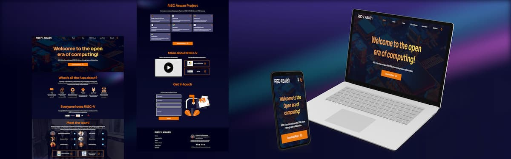

# RISC-Aswan

My graduation project landing page, a RISC-V RV32I core with pipelining and hazard unit.

### 🔗 Links

-   [Live Site](https://risc-aswan-2022.web.app/)
-   [Source Repo on Github](https://github.com/MuhammadM1998/RISC-Aswan)
-   [Project Files on Github](https://github.com/MuhammadM1998/RISC-Aswan/tree/main/src/RA-RV32IPPHU)

### ‍💻 Project Stack

Feedback is always appreciated 📝🙏
